# IAMS — Internal Audit Management System
## Enterprise Database Design Specification

**Version:** 1.0 (Target Schema v1)
**Prepared:** 2026-05-12
**Status:** Design specification for production-grade enterprise IAMS
**Scope:** Complete relational database design including ERD, entities, relationships, normalization, indexes, constraints, and migration roadmap.

---

## TABLE OF CONTENTS

1. [Executive Summary](#1-executive-summary)
2. [Design Philosophy & Principles](#2-design-philosophy--principles)
3. [Domain Map & Bounded Contexts](#3-domain-map--bounded-contexts)
4. [Entity Catalog (Master List)](#4-entity-catalog-master-list)
5. [Entity Relationship Diagram (ERD)](#5-entity-relationship-diagram-erd)
6. [Detailed Entity Specifications](#6-detailed-entity-specifications)
   - 6.1 [Identity, Access & Tenancy](#61-identity-access--tenancy)
   - 6.2 [Organizational Structure](#62-organizational-structure)
   - 6.3 [Audit Universe & Risk Management](#63-audit-universe--risk-management)
   - 6.4 [Engagement (Audit) Lifecycle](#64-engagement-audit-lifecycle)
   - 6.5 [Work Programs & Fieldwork](#65-work-programs--fieldwork)
   - 6.6 [Evidence & Working Papers](#66-evidence--working-papers)
   - 6.7 [Findings, Corrective Actions & Follow-Up](#67-findings-corrective-actions--follow-up)
   - 6.8 [Audit Reporting](#68-audit-reporting)
   - 6.9 [Compliance, Frameworks & Controls](#69-compliance-frameworks--controls)
   - 6.10 [Control Self-Assessment (CSA)](#610-control-self-assessment-csa)
   - 6.11 [Quality Assurance & Improvement Program (QAIP)](#611-quality-assurance--improvement-program-qaip)
   - 6.12 [Workflow, Approvals & Tasks](#612-workflow-approvals--tasks)
   - 6.13 [Resource Management & Time Tracking](#613-resource-management--time-tracking)
   - 6.14 [Notifications & Communication](#614-notifications--communication)
   - 6.15 [Document Management](#615-document-management)
   - 6.16 [Audit Trail & Observability](#616-audit-trail--observability)
   - 6.17 [Cross-Cutting Polymorphic Entities](#617-cross-cutting-polymorphic-entities)
   - 6.18 [Configuration, Numbering & System](#618-configuration-numbering--system)
7. [Normalization Analysis](#7-normalization-analysis)
8. [Indexing & Performance Strategy](#8-indexing--performance-strategy)
9. [Constraints, Triggers & Data Integrity](#9-constraints-triggers--data-integrity)
10. [Security & Data Protection](#10-security--data-protection)
11. [Migration Roadmap (From Current → Target)](#11-migration-roadmap-from-current--target)
12. [Open Questions & Future Evolution](#12-open-questions--future-evolution)
13. [Appendix A — Enumerations](#appendix-a--enumerations)
14. [Appendix B — Field Type Conventions](#appendix-b--field-type-conventions)

---

## 1. EXECUTIVE SUMMARY

The IAMS database supports an **enterprise-grade Internal Audit Management System** aligned with **IIA International Professional Practices Framework (IPPF)**, including Standards 1300 (QAIP), 2010 (Audit Planning), 2200 (Engagement Planning), 2300 (Performing the Engagement), 2330 (Documenting Information), 2400 (Communicating Results), and 2500 (Monitoring Progress).

### Scale & Scope
- **~90 entities** across 18 bounded contexts (vs. 40 in current MVP)
- **PostgreSQL 15+** as system of record (JSONB, partial indexes, CHECK constraints, row-level security ready)
- **UUID primary keys** throughout (consistent with current convention; avoids enumeration attacks)
- **Multi-tenant ready** via `organization_id` discriminator column (optional, enabled by feature flag)
- **Soft-deletion** on most entities (compliance retention requires preservation)
- **Append-only audit log** (REVOKE UPDATE/DELETE at DB level for SOX/IIA 2330)
- **i18n-ready** — separate translation tables for catalog entities (frameworks, controls, taxonomies)

### Key Design Differentiators vs Current Schema
| Concern | Current MVP | Target Enterprise |
|---|---|---|
| User references | Mixed `CharField` + nullable FK | Strict FK to `users.User`; denormalized name cached in `*_snapshot` JSONB on immutable records (audit log, working papers post-sign) |
| Departments | Flat string + nullable FK | Hierarchical `Department` tree (parent_id, mptt/closure-table) |
| Risk taxonomy | Free-form strings | Reference tables: `RiskCategory`, `RiskAppetiteStatement`, `RiskTaxonomy` |
| Controls | Implicit (text fields on findings) | First-class `Control` entity, `ControlObjective`, `ControlTest`, `ControlEffectivenessHistory` |
| Compliance | None | `Framework` + `ComplianceRequirement` + `ControlMapping` matrix |
| Audit Universe | Flat list | Hierarchical (Process → Sub-process → Activity) with risk inheritance |
| Engagement | Single `Audit` row | `Engagement` + `EngagementPhase` + `EngagementMilestone` |
| Sampling | None | `SampleSet`, `SampleItem` linked to `WorkProcedure` |
| Tags/Labels | None | Polymorphic `Tag` + `TaggedItem` |
| Comments | Per-entity-id string | Polymorphic via `ContentType` (already partial) + threading + reactions + mentions |
| Custom fields | None | `FieldDefinition` + `FieldValue` polymorphic (extensibility per tenant) |
| Multi-tenancy | None | Optional `organization_id` discriminator on all tenant-scoped tables |
| Time tracking | Single `TimeEntry` | `TimeEntry` + `Timesheet` (weekly aggregate) + `TimeApproval` |

---

## 2. DESIGN PHILOSOPHY & PRINCIPLES

### 2.1 Guiding Principles

1. **Normalize to 3NF, denormalize deliberately.** Each fact stored once. Strategic denormalization only for: (a) immutability snapshots (audit log, signed working papers), (b) hot read paths (dashboard counters), (c) full-text search columns.

2. **Polymorphism via `ContentType`, not table inheritance.** Continue Django's `GenericForeignKey` pattern for cross-cutting entities (Comment, AuditLogEntry, Tag, Attachment, Reaction). Avoid concrete inheritance — it leaks across domains.

3. **Soft delete by default.** Add `deleted_at TIMESTAMPTZ NULL` to every business entity. Hard-delete only allowed by a privileged retention job after policy expiry.

4. **Append-only for audit/compliance records.** `AuditLogEntry`, `ApprovalDecision`, `SignatureEvent`, `NotificationDelivery` reject UPDATE/DELETE at DB level (Postgres REVOKE + Django save guard).

5. **UUIDv7 keys** (time-ordered UUIDs) for indexable insertion patterns. Falls back to UUIDv4 if v7 generation unavailable. Stored as `uuid` type in Postgres.

6. **Domain identifiers** (audit number, finding number, WP reference) are separate from PKs. Human-facing IDs are generated via `Sequence` entity with locking, format pattern, and per-fiscal-year reset.

7. **Status as enum FK, not string.** Lifecycle status columns reference a small `WorkflowState` lookup so transitions are constrained by `WorkflowTransition`. Where compatibility with the existing string-enum is needed (current schema), keep CHOICES + CHECK constraint.

8. **Timestamps:** `created_at`, `updated_at` (auto), `deleted_at` (soft delete). Use TIMESTAMPTZ; store all timestamps in UTC; convert at edge.

9. **Money/decimals:** `NUMERIC(precision, scale)`, never FLOAT. Currency stored in ISO-4217 code alongside.

10. **JSONB for evolving payloads** (audit log diff, custom field values, workflow form schemas). Always with a documented shape contract.

11. **Indexing rule of three:** every FK indexed; every column appearing in a WHERE for sorts/filters indexed; composite indexes ordered by selectivity. Partial indexes on `deleted_at IS NULL`.

12. **i18n separation:** translatable text columns live on `EntityTranslation` join tables, not on the parent. Avoids JSON sprawl for translated strings on catalog entities.

### 2.2 Naming Conventions

- **Tables:** `snake_case`, singular noun, prefixed by domain when ambiguous (e.g., `audit_engagement`, `qaip_assessment`, `csa_response`). For Django app cohabitation, keep `iams_` prefix on Django-managed tables (already in place via `db_table` Meta or app_label).
- **Columns:** `snake_case`. FK columns named `<related_entity>_id` (Django default).
- **Indexes:** `ix_<table>_<columns>` (or Django's `idx_…`).
- **Constraints:** `ck_<table>_<rule>`, `uq_<table>_<columns>`, `fk_<table>_<related>`.
- **Enums (CHECK):** `<table>_<column>_choices`.

### 2.3 Reference Data vs Transactional Data

| Reference (slow-changing) | Transactional (fast-changing) |
|---|---|
| Department, Role, Permission, Framework, Control, RiskCategory, AuditCommittee, NumberingSequence | Engagement, Finding, CAP, TimeEntry, Notification, AuditLogEntry, ApprovalRequest |

Reference data has CRUD UIs gated by `manage_settings`; transactional data follows domain RBAC.

---

## 3. DOMAIN MAP & BOUNDED CONTEXTS

```
┌──────────────────────────────────────────────────────────────────────────────────┐
│                          IAMS DOMAIN MAP (18 contexts)                            │
├──────────────────────────────────────────────────────────────────────────────────┤
│                                                                                   │
│   ┌─────────────────────┐    ┌─────────────────────┐    ┌─────────────────────┐ │
│   │ 1. IDENTITY & RBAC  │    │ 2. ORG STRUCTURE    │    │ 3. AUDIT UNIVERSE   │ │
│   │  - User             │←──→│  - Organization     │←──→│  - AuditableEntity  │ │
│   │  - Role/Permission  │    │  - Department (tree)│    │  - RiskCategory     │ │
│   │  - UserProfile      │    │  - Position         │    │  - RiskAssessment   │ │
│   │  - APIToken/Session │    │  - AuditCommittee   │    │  - RiskHistory      │ │
│   └──────────┬──────────┘    └──────────┬──────────┘    └──────────┬──────────┘ │
│              │                          │                          │            │
│              ▼                          ▼                          ▼            │
│   ┌──────────────────────────────────────────────────────────────────────────┐ │
│   │                  4. ENGAGEMENT (AUDIT) LIFECYCLE                          │ │
│   │   Engagement → Phase → Milestone → Status History                         │ │
│   │   AuditPlan → AuditPlanEntry → AuditPlanApproval                          │ │
│   └────┬─────────────────────────────────────────────────────────────────────┘ │
│        │                                                                        │
│        ├──→ 5. WORK PROGRAMS    (WorkProgram, Procedure, Step, Sample)         │
│        ├──→ 6. EVIDENCE/WP      (EvidenceFile, WorkingPaper, Signature)        │
│        ├──→ 7. FINDINGS/CAP     (Finding, CAP, FollowUp, RootCause, Remediation)│
│        ├──→ 8. REPORTING        (AuditReport, ReportSection, Distribution)     │
│        └──→ 12. APPROVALS       (ApprovalRequest, Step, Chain, Decision)       │
│                                                                                 │
│   ┌─────────────────────┐    ┌─────────────────────┐    ┌─────────────────────┐│
│   │ 9. COMPLIANCE       │    │ 10. CSA             │    │ 11. QAIP            ││
│   │  - Framework        │    │  - Questionnaire    │    │  - Assessment       ││
│   │  - Requirement      │    │  - Question         │    │  - Finding (QA)     ││
│   │  - Control          │    │  - Response/Answer  │    │  - Survey           ││
│   │  - ControlMapping   │    │  - Challenge        │    │  - KPI              ││
│   └─────────────────────┘    └─────────────────────┘    └─────────────────────┘│
│                                                                                 │
│   ┌─────────────────────┐    ┌─────────────────────┐    ┌─────────────────────┐│
│   │ 13. RESOURCES       │    │ 14. NOTIFICATIONS   │    │ 15. DOCUMENTS       ││
│   │  - Auditor          │    │  - Notification     │    │  - ManagedDocument  ││
│   │  - Assignment       │    │  - Preference       │    │  - DocumentVersion  ││
│   │  - TimeEntry        │    │  - DeliveryEvent    │    │  - DocumentAccess   ││
│   │  - Timesheet/Budget │    │  - Template         │    │                     ││
│   └─────────────────────┘    └─────────────────────┘    └─────────────────────┘│
│                                                                                 │
│   ┌─────────────────────┐    ┌─────────────────────┐    ┌─────────────────────┐│
│   │ 16. AUDIT TRAIL     │    │ 17. CROSS-CUTTING   │    │ 18. SYSTEM CONFIG   ││
│   │  - AuditLogEntry    │    │  - Comment+Reply    │    │  - NumberingSequence││
│   │  - DataExportLog    │    │  - Tag/TaggedItem   │    │  - FeatureFlag      ││
│   │  - LoginAttempt     │    │  - Reaction/Mention │    │  - FieldDefinition  ││
│   │  - SecurityEvent    │    │  - Attachment       │    │  - SystemSetting    ││
│   └─────────────────────┘    └─────────────────────┘    └─────────────────────┘│
│                                                                                 │
└──────────────────────────────────────────────────────────────────────────────────┘
```

---

## 4. ENTITY CATALOG (MASTER LIST)

The complete inventory of database tables, grouped by domain. Tables marked **[NEW]** are additions beyond the current MVP schema; **[ENHANCED]** are reshaped versions of existing tables; the rest are essentially carried forward.

### 4.1 Identity, Access & Tenancy (10 tables)
| # | Table | Status | Purpose |
|---|---|---|---|
| 1 | `organization` | [NEW] | Tenant root (multi-tenant) |
| 2 | `user` | [ENHANCED] | Django auth user, extended |
| 3 | `user_profile` | carried | Extended profile (department, role) |
| 4 | `role` | carried | Named role bundle |
| 5 | `permission` | carried | Atomic permission key |
| 6 | `role_permission` (M2M) | carried | Role → Permission join |
| 7 | `user_role_assignment` | [NEW] | Multiple roles per user, scoped (org/dept/engagement) |
| 8 | `api_token` | [NEW] | Long-lived API tokens (JWT blocklist already exists; persistent tokens here) |
| 9 | `user_session` | [NEW] | Active session tracking for revocation |
| 10 | `mfa_device` | [NEW] | Multi-factor authentication (TOTP/WebAuthn) |
| 11 | `password_reset_token` | [NEW] | Tokenized reset (currently in djoser; persist here) |
| 12 | `login_attempt` | [NEW] | Auth telemetry for brute-force defense |

### 4.2 Organizational Structure (5 tables)
| # | Table | Status | Purpose |
|---|---|---|---|
| 13 | `department` | [ENHANCED] | Hierarchical (parent_id) |
| 14 | `position` | [NEW] | Job titles/grades |
| 15 | `department_member` | [NEW] | User ↔ Department join with role-in-dept |
| 16 | `audit_committee` | [NEW] | Board-level audit committee |
| 17 | `audit_committee_member` | [NEW] | Members of the audit committee |

### 4.3 Audit Universe & Risk (12 tables)
| # | Table | Status | Purpose |
|---|---|---|---|
| 18 | `auditable_entity` | [ENHANCED] | Hierarchical (parent_id) — process tree |
| 19 | `entity_type_taxonomy` | [NEW] | Process/System/Function/Compliance Area classification |
| 20 | `risk_category` | [NEW] | Operational, Financial, Strategic, Compliance, IT, Reputational, … |
| 21 | `risk_appetite_statement` | [NEW] | Board-approved appetite per category |
| 22 | `risk_assessment_cycle` | [NEW] | Annual/quarterly risk-assessment campaigns |
| 23 | `risk_assessment_record` | [ENHANCED] | Risk register row (likelihood × impact × controls) |
| 24 | `risk_assessment_sheet` | carried | Workbook-style grouping |
| 25 | `risk_assessment_matrix_cell` | carried | 3×3 / 5×5 likelihood-impact matrix |
| 26 | `risk_assessment_summary_item` | carried | Plan-enrollment summary |
| 27 | `risk_assessment_import_issue` | carried | Workbook validation issues |
| 28 | `risk_history_entry` | carried | Time-series risk-rating snapshots |
| 29 | `entity_risk_assessment` | [NEW] | Link table: AuditableEntity ↔ RiskAssessmentRecord (M2M) |

### 4.4 Audit Plan & Engagement Lifecycle (10 tables)
| # | Table | Status | Purpose |
|---|---|---|---|
| 30 | `audit_plan` | [NEW] | Annual audit plan |
| 31 | `audit_plan_entry` | [NEW] | One planned engagement on the plan |
| 32 | `engagement` (formerly `audit`) | [ENHANCED] | The audit engagement |
| 33 | `engagement_phase` | [NEW] | Planning, Fieldwork, Reporting, Follow-up |
| 34 | `engagement_milestone` | [NEW] | Discrete milestones with deadlines |
| 35 | `engagement_status_history` | [NEW] | Status change journal |
| 36 | `engagement_team_member` | [NEW] | Auditors on an engagement (role + period) |
| 37 | `engagement_objective` | [NEW] | Multiple objectives per engagement |
| 38 | `engagement_scope_item` | [NEW] | Itemized scope inclusions/exclusions |
| 39 | `audit_template` | [NEW] | Reusable engagement template |
| 40 | `audit_template_section` | [NEW] | Sections within a template |

### 4.5 Work Programs & Fieldwork (8 tables)
| # | Table | Status | Purpose |
|---|---|---|---|
| 41 | `work_program` | carried | A program of audit procedures |
| 42 | `work_procedure` | carried | A procedure within a program |
| 43 | `work_procedure_step` | carried | A test step within a procedure |
| 44 | `sample_set` | [NEW] | Population + sample selection for a procedure |
| 45 | `sample_item` | [NEW] | Individual sampled record |
| 46 | `test_result` | [NEW] | Detailed test result (pass/fail + evidence link) per sample |
| 47 | `checklist_item` | carried | Per-engagement checklist |
| 48 | `audit_methodology` | [NEW] | Codified methodology document (link to engagement) |

### 4.6 Evidence & Working Papers (6 tables)
| # | Table | Status | Purpose |
|---|---|---|---|
| 49 | `evidence_file` | carried | Engagement-scoped file attachment |
| 50 | `working_paper` | carried | Signed-off working paper (versioned) |
| 51 | `working_paper_version` (view/derived) | optional | View on `working_paper` self-FK chain |
| 52 | `signature_event` | [NEW] | Sign-off event audit trail (immutable) |
| 53 | `attachment` | [NEW] | Polymorphic attachment for any entity |
| 54 | `file_scan_result` | [NEW] | Detailed scan history (vs current single field) |

### 4.7 Findings, CAPs, Follow-Up (8 tables)
| # | Table | Status | Purpose |
|---|---|---|---|
| 55 | `finding` | [ENHANCED] | Audit observation |
| 56 | `finding_severity_history` | [NEW] | Severity changes audit |
| 57 | `corrective_action` (CAP) | carried | Remediation plan |
| 58 | `cap_milestone` | [NEW] | Sub-tasks within a CAP |
| 59 | `cap_progress_update` | [NEW] | Periodic progress updates |
| 60 | `follow_up_item` | [ENHANCED] | Post-remediation validation |
| 61 | `root_cause_analysis` | [NEW] | Detailed RCA (Why-Why, Fishbone, etc.) |
| 62 | `finding_recurrence_link` | [NEW] | Links a new finding to a recurrence of older one |

### 4.8 Audit Reporting (6 tables)
| # | Table | Status | Purpose |
|---|---|---|---|
| 63 | `audit_report` | carried | Report header |
| 64 | `audit_report_section` | carried | Ordered sections |
| 65 | `audit_report_distribution` | [NEW] | Distribution list |
| 66 | `audit_report_recipient_view` | [NEW] | Who has viewed/acknowledged |
| 67 | `report_template` | [NEW] | Reusable report templates |
| 68 | `report_template_section` | [NEW] | Template sections (with placeholders) |

### 4.9 Compliance, Frameworks & Controls (10 tables)
| # | Table | Status | Purpose |
|---|---|---|---|
| 69 | `framework` | [NEW] | SOX, ISO 27001, COSO, GDPR, … |
| 70 | `framework_version` | [NEW] | Versioning of frameworks |
| 71 | `compliance_requirement` | [NEW] | Individual clauses of a framework |
| 72 | `control` | [NEW] | Internal control |
| 73 | `control_objective` | [NEW] | Higher-level control objectives |
| 74 | `control_mapping` | [NEW] | Control ↔ ComplianceRequirement (M:N) |
| 75 | `control_test_result` | [NEW] | Periodic effectiveness testing |
| 76 | `control_owner` | [NEW] | User ↔ Control ownership |
| 77 | `control_evidence` | [NEW] | Control ↔ EvidenceFile join |
| 78 | `control_effectiveness_history` | [NEW] | Time-series effectiveness ratings |

### 4.10 Control Self-Assessment (4 tables)
| # | Table | Status | Purpose |
|---|---|---|---|
| 79 | `csa_questionnaire` | carried | Reusable questionnaire |
| 80 | `csa_question` | carried | Single question |
| 81 | `csa_response` | carried | Business-unit response |
| 82 | `csa_answer` | carried | Single answer with challenge thread |

### 4.11 QAIP (4 tables)
| # | Table | Status | Purpose |
|---|---|---|---|
| 83 | `qaip_assessment` | carried | Internal/external/peer/post-engagement quality review |
| 84 | `qaip_finding` | carried | Finding against the IA function |
| 85 | `stakeholder_survey` | carried | Satisfaction survey response |
| 86 | `audit_kpi` | carried | IA-function KPI |

### 4.12 Workflow, Approvals & Tasks (8 tables)
| # | Table | Status | Purpose |
|---|---|---|---|
| 87 | `approval_chain_template` | carried | Chain definition |
| 88 | `approval_request` | carried | An approval-needing item |
| 89 | `approval_step` | carried | One step in a chain |
| 90 | `approval_decision` | [NEW] | Immutable per-step decision event |
| 91 | `approval_delegation` | [NEW] | "While I'm OOO, X approves for me" |
| 92 | `workflow_state` | [NEW] | Reference table of states |
| 93 | `workflow_transition` | [NEW] | Allowed transitions per entity type |
| 94 | `task` | [NEW] | User-assigned task (My Tasks view) |

### 4.13 Resource Management (7 tables)
| # | Table | Status | Purpose |
|---|---|---|---|
| 95 | `auditor` | [ENHANCED] | Auditor profile (extends user) |
| 96 | `auditor_skill` | [NEW] | Normalized skill catalog |
| 97 | `auditor_certification` | [NEW] | Certification catalog with expiry tracking |
| 98 | `audit_assignment` | carried | Auditor → engagement allocation |
| 99 | `time_entry` | carried | Daily time entry |
| 100 | `timesheet` | [NEW] | Weekly aggregate + approval |
| 101 | `hours_budget` | carried | Budgeted vs actual per engagement |

### 4.14 Notifications & Communication (5 tables)
| # | Table | Status | Purpose |
|---|---|---|---|
| 102 | `notification` | carried | In-app notification |
| 103 | `notification_preference` | carried | Per-user, per-kind delivery toggles |
| 104 | `notification_template` | [NEW] | Templated body + variable schema |
| 105 | `notification_delivery_event` | [NEW] | Per-channel delivery log (in-app / email / SMS / push) |
| 106 | `email_event` | [NEW] | Bounces, complaints, opens |

### 4.15 Document Management (5 tables)
| # | Table | Status | Purpose |
|---|---|---|---|
| 107 | `managed_document` | [ENHANCED] | Org-wide document |
| 108 | `document_version` | [NEW] | Versions extracted from JSON list → first-class rows |
| 109 | `document_access_grant` | [NEW] | Explicit grants |
| 110 | `document_access_log` | [NEW] | Read/download event log |
| 111 | `document_tag` (or use polymorphic Tag) | [NEW] | Tag join |

### 4.16 Audit Trail & Observability (5 tables)
| # | Table | Status | Purpose |
|---|---|---|---|
| 112 | `audit_log_entry` | carried | Append-only change log |
| 113 | `data_export_log` | [NEW] | Every export (PDF/CSV/Excel) — required for IIA 2330 |
| 114 | `security_event` | [NEW] | Login failures, MFA challenges, permission denials |
| 115 | `webhook_delivery` | [NEW] | Outbound webhook attempts |
| 116 | `system_health_check` | [NEW] | Periodic self-check results |

### 4.17 Cross-Cutting Polymorphic (7 tables)
| # | Table | Status | Purpose |
|---|---|---|---|
| 117 | `comment` | [ENHANCED] | Threaded comments on any entity |
| 118 | `mention` | [NEW] | @-mentions inside comments |
| 119 | `reaction` | [NEW] | Emoji reactions |
| 120 | `tag` | [NEW] | Tag taxonomy |
| 121 | `tagged_item` | [NEW] | Polymorphic tag attachment |
| 122 | `activity_item` | carried | Activity feed entry |
| 123 | `timeline_event` | carried | Engagement timeline event |

### 4.18 Configuration & System (8 tables)
| # | Table | Status | Purpose |
|---|---|---|---|
| 124 | `numbering_sequence` | [NEW] | Generates audit/finding/CAP numbers (e.g., F-2026-001) |
| 125 | `feature_flag` | [NEW] | Per-tenant feature toggles |
| 126 | `system_setting` | [NEW] | Key-value config |
| 127 | `field_definition` | [NEW] | Custom field schemas per entity type |
| 128 | `field_value` | [NEW] | Polymorphic custom field values |
| 129 | `email_template` | [NEW] | Templated email body |
| 130 | `lookup_value` | [NEW] | Catch-all lookup (status, severity, currencies, …) |
| 131 | `entity_translation` | [NEW] | i18n translations of reference data |

**Total: ~131 tables** in target schema.

---

## 5. ENTITY RELATIONSHIP DIAGRAM (ERD)

The full ERD is large. Below is a domain-grouped Mermaid diagram. The strongest cross-domain relations are shown; internal sub-relations are detailed in §6.

```mermaid
erDiagram
    %% ====================== IDENTITY ======================
    ORGANIZATION ||--o{ USER : "scopes"
    USER ||--|| USER_PROFILE : has
    USER ||--o{ USER_ROLE_ASSIGNMENT : "is assigned"
    ROLE ||--o{ USER_ROLE_ASSIGNMENT : "applies"
    ROLE ||--o{ ROLE_PERMISSION : "grants"
    PERMISSION ||--o{ ROLE_PERMISSION : "granted by"
    USER ||--o{ MFA_DEVICE : has
    USER ||--o{ USER_SESSION : has
    USER ||--o{ LOGIN_ATTEMPT : "audited"

    %% ====================== ORG ======================
    ORGANIZATION ||--o{ DEPARTMENT : has
    DEPARTMENT ||--o{ DEPARTMENT : "parent_of"
    USER }o--o{ DEPARTMENT_MEMBER : "joins"
    DEPARTMENT ||--o{ DEPARTMENT_MEMBER : "has"
    POSITION ||--o{ DEPARTMENT_MEMBER : "holds"
    AUDIT_COMMITTEE ||--o{ AUDIT_COMMITTEE_MEMBER : "has"
    USER ||--o{ AUDIT_COMMITTEE_MEMBER : "is"

    %% ====================== AUDIT UNIVERSE ======================
    DEPARTMENT ||--o{ AUDITABLE_ENTITY : "owns"
    AUDITABLE_ENTITY ||--o{ AUDITABLE_ENTITY : "parent_of"
    ENTITY_TYPE_TAXONOMY ||--o{ AUDITABLE_ENTITY : "classifies"
    RISK_CATEGORY ||--o{ RISK_ASSESSMENT_RECORD : "categorizes"
    RISK_ASSESSMENT_CYCLE ||--o{ RISK_ASSESSMENT_RECORD : "contains"
    RISK_ASSESSMENT_SHEET ||--o{ RISK_ASSESSMENT_RECORD : "groups"
    AUDITABLE_ENTITY }o--o{ ENTITY_RISK_ASSESSMENT : "rated_by"
    RISK_ASSESSMENT_RECORD }o--o{ ENTITY_RISK_ASSESSMENT : "rates"
    AUDITABLE_ENTITY ||--o{ RISK_HISTORY_ENTRY : "tracks"

    %% ====================== ENGAGEMENT ======================
    AUDIT_PLAN ||--o{ AUDIT_PLAN_ENTRY : "contains"
    AUDIT_PLAN_ENTRY ||--o| ENGAGEMENT : "becomes"
    DEPARTMENT ||--o{ ENGAGEMENT : "subject_of"
    ENGAGEMENT ||--o{ ENGAGEMENT_PHASE : has
    ENGAGEMENT ||--o{ ENGAGEMENT_MILESTONE : has
    ENGAGEMENT ||--o{ ENGAGEMENT_STATUS_HISTORY : has
    ENGAGEMENT ||--o{ ENGAGEMENT_TEAM_MEMBER : has
    USER ||--o{ ENGAGEMENT_TEAM_MEMBER : "serves_on"
    ENGAGEMENT ||--o{ ENGAGEMENT_OBJECTIVE : has
    ENGAGEMENT ||--o{ ENGAGEMENT_SCOPE_ITEM : has
    AUDIT_TEMPLATE ||--o| ENGAGEMENT : "instantiated_into"
    AUDIT_TEMPLATE ||--o{ AUDIT_TEMPLATE_SECTION : "contains"

    %% ====================== WORK PROGRAM ======================
    ENGAGEMENT ||--o{ WORK_PROGRAM : has
    WORK_PROGRAM ||--o{ WORK_PROCEDURE : has
    WORK_PROCEDURE ||--o{ WORK_PROCEDURE_STEP : has
    WORK_PROCEDURE ||--o{ SAMPLE_SET : "tests"
    SAMPLE_SET ||--o{ SAMPLE_ITEM : has
    SAMPLE_ITEM ||--o{ TEST_RESULT : has
    ENGAGEMENT ||--o{ CHECKLIST_ITEM : has

    %% ====================== EVIDENCE / WP ======================
    ENGAGEMENT ||--o{ EVIDENCE_FILE : has
    ENGAGEMENT ||--o{ WORKING_PAPER : has
    WORKING_PAPER ||--o{ WORKING_PAPER : "parent_of"
    WORKING_PAPER }o--o{ FINDING : "supports"
    WORKING_PAPER ||--o{ SIGNATURE_EVENT : "signed_by"
    EVIDENCE_FILE ||--o{ FILE_SCAN_RESULT : "scanned_for"
    WORKING_PAPER ||--o{ FILE_SCAN_RESULT : "scanned_for"

    %% ====================== FINDINGS / CAP ======================
    ENGAGEMENT ||--o{ FINDING : "raises"
    FINDING ||--o{ CORRECTIVE_ACTION : "remediated_by"
    CORRECTIVE_ACTION ||--o{ CAP_MILESTONE : has
    CORRECTIVE_ACTION ||--o{ CAP_PROGRESS_UPDATE : has
    FINDING ||--o{ FOLLOW_UP_ITEM : "validated_by"
    FINDING ||--|| ROOT_CAUSE_ANALYSIS : "has"
    FINDING ||--o{ FINDING_SEVERITY_HISTORY : has
    FINDING ||--o{ FINDING_RECURRENCE_LINK : "recurs_from"

    %% ====================== REPORTING ======================
    ENGAGEMENT ||--o{ AUDIT_REPORT : has
    AUDIT_REPORT ||--o{ AUDIT_REPORT_SECTION : has
    REPORT_TEMPLATE ||--o| AUDIT_REPORT : "instantiated_from"
    AUDIT_REPORT ||--o{ AUDIT_REPORT_DISTRIBUTION : "distributed_to"
    AUDIT_REPORT_DISTRIBUTION ||--o{ AUDIT_REPORT_RECIPIENT_VIEW : "viewed_by"

    %% ====================== COMPLIANCE / CONTROLS ======================
    FRAMEWORK ||--o{ FRAMEWORK_VERSION : has
    FRAMEWORK_VERSION ||--o{ COMPLIANCE_REQUIREMENT : has
    CONTROL_OBJECTIVE ||--o{ CONTROL : "satisfied_by"
    CONTROL }o--o{ CONTROL_MAPPING : "implements"
    COMPLIANCE_REQUIREMENT }o--o{ CONTROL_MAPPING : "implemented_by"
    CONTROL ||--o{ CONTROL_TEST_RESULT : "tested_by"
    CONTROL ||--o{ CONTROL_OWNER : "owned_by"
    CONTROL ||--o{ CONTROL_EFFECTIVENESS_HISTORY : "rated_over_time"
    CONTROL ||--o{ CONTROL_EVIDENCE : "evidenced_by"
    AUDITABLE_ENTITY ||--o{ CONTROL : "owns"

    %% ====================== CSA ======================
    CSA_QUESTIONNAIRE ||--o{ CSA_QUESTION : has
    CSA_QUESTIONNAIRE ||--o{ CSA_RESPONSE : "responded_via"
    AUDITABLE_ENTITY ||--o{ CSA_RESPONSE : "responds"
    CSA_RESPONSE ||--o{ CSA_ANSWER : has
    CSA_QUESTION ||--o{ CSA_ANSWER : "answered_by"
    CSA_ANSWER }o--o| EVIDENCE_FILE : "supports"

    %% ====================== QAIP ======================
    QAIP_ASSESSMENT ||--o{ QAIP_FINDING : has
    ENGAGEMENT ||--o{ STAKEHOLDER_SURVEY : "evaluated_by"

    %% ====================== APPROVALS ======================
    APPROVAL_CHAIN_TEMPLATE ||--o| APPROVAL_REQUEST : "configures"
    APPROVAL_REQUEST ||--o{ APPROVAL_STEP : has
    APPROVAL_STEP ||--o{ APPROVAL_DECISION : "decided_by"
    USER ||--o{ APPROVAL_DELEGATION : "delegates"

    %% ====================== RESOURCES ======================
    USER ||--o| AUDITOR : "may_be"
    AUDITOR ||--o{ AUDIT_ASSIGNMENT : has
    ENGAGEMENT ||--o{ AUDIT_ASSIGNMENT : has
    AUDITOR ||--o{ TIME_ENTRY : "logs"
    ENGAGEMENT ||--o{ TIME_ENTRY : "consumes"
    TIME_ENTRY }o--|| TIMESHEET : "rolls_up_to"
    AUDITOR ||--o{ AUDITOR_SKILL : has
    AUDITOR ||--o{ AUDITOR_CERTIFICATION : has
    ENGAGEMENT ||--|| HOURS_BUDGET : "budgeted_by"

    %% ====================== NOTIFICATIONS ======================
    USER ||--o{ NOTIFICATION : "receives"
    USER ||--o{ NOTIFICATION_PREFERENCE : "configures"
    NOTIFICATION_TEMPLATE ||--o{ NOTIFICATION : "renders_to"
    NOTIFICATION ||--o{ NOTIFICATION_DELIVERY_EVENT : "delivered_via"

    %% ====================== DOCUMENTS ======================
    DEPARTMENT ||--o{ MANAGED_DOCUMENT : owns
    MANAGED_DOCUMENT ||--o{ DOCUMENT_VERSION : has
    MANAGED_DOCUMENT ||--o{ DOCUMENT_ACCESS_GRANT : "shared_via"
    MANAGED_DOCUMENT ||--o{ DOCUMENT_ACCESS_LOG : "accessed_in"

    %% ====================== AUDIT TRAIL ======================
    USER ||--o{ AUDIT_LOG_ENTRY : "actor_of"
    USER ||--o{ DATA_EXPORT_LOG : "exports"

    %% ====================== POLYMORPHIC ======================
    COMMENT ||--o{ COMMENT : "replies_to"
    COMMENT ||--o{ MENTION : "mentions"
    COMMENT ||--o{ REACTION : "reacted_to"
    TAG ||--o{ TAGGED_ITEM : "applied_via"
```



A high-resolution PDF ERD can be generated from the `pgmodeler` / `dbdiagram.io` source under `docs/erd/` (TBD — see §11).

---

## 6. DETAILED ENTITY SPECIFICATIONS

> Convention: `PK` = primary key, `FK` = foreign key, `UQ` = unique, `IDX` = indexed.
> All entities below carry `id UUID PK`, `created_at`, `updated_at` unless noted otherwise; soft-deletable entities also carry `deleted_at TIMESTAMPTZ NULL`.

---

### 6.1 Identity, Access & Tenancy

#### `organization`
| Column | Type | Notes |
|---|---|---|
| id | UUID PK | |
| name | VARCHAR(255) UQ | |
| slug | VARCHAR(64) UQ | URL-safe |
| legal_name | VARCHAR(255) | |
| country_code | CHAR(2) | ISO-3166 |
| timezone | VARCHAR(64) | IANA |
| fiscal_year_end_month | SMALLINT (1-12) | |
| settings_json | JSONB | branding, currency, etc. |
| is_active | BOOLEAN default true | |
| created_at / updated_at | TIMESTAMPTZ | |

> A single-tenant deployment can skip this table or always FK to a single seed row; multi-tenant deployments enable RLS on `organization_id`.

#### `user` (extends `auth_user`)
| Column | Type | Notes |
|---|---|---|
| id | UUID PK | (Django default would be INT — override) |
| email | CITEXT UQ NOT NULL | case-insensitive |
| password | VARCHAR(255) | Django-hashed |
| first_name, last_name | VARCHAR(150) | |
| display_name | VARCHAR(255) | |
| avatar_url | VARCHAR(512) | |
| phone | VARCHAR(32) | E.164 |
| timezone | VARCHAR(64) | overrides org timezone |
| locale | VARCHAR(10) | "en", "ar", "fr" |
| is_staff, is_active, is_superuser | BOOLEAN | Django |
| last_login | TIMESTAMPTZ | |
| password_changed_at | TIMESTAMPTZ | for rotation policy |
| mfa_enabled | BOOLEAN | |
| failed_login_count | SMALLINT | reset on success |
| locked_until | TIMESTAMPTZ NULL | brute-force lockout |
| organization_id | FK → organization | nullable for system users |

**Indexes:** `(email)` unique; `(organization_id, is_active)`.

#### `user_profile`
| Column | Type | Notes |
|---|---|---|
| user_id | OneToOne FK → user PK | |
| primary_role_id | FK → role | nullable |
| primary_department_id | FK → department | nullable |
| position_id | FK → position | nullable |
| status | ENUM('Active','Inactive','Suspended','Onboarding') | |
| bio | TEXT | |
| custom_fields | JSONB | extensibility |

#### `role`
Carried forward from current schema. Adds:
| Column | Type | Notes |
|---|---|---|
| organization_id | FK → organization NULL | NULL = system role |
| is_system | BOOLEAN | seeded; not user-editable |
| parent_role_id | FK → role | optional inheritance |

#### `permission`
Carried forward. Adds:
| Column | Notes |
|---|---|
| object_type | VARCHAR(64) NULL | for object-level permissions (e.g., "engagement", "finding") |
| action | VARCHAR(32) | view/create/edit/delete/approve/export |

#### `role_permission` (M2M)
Standard join: `(role_id, permission_id) PK`.

#### `user_role_assignment`
Allows multi-role and **scope-bound** roles (e.g., "Lead Auditor" only on a specific engagement).
| Column | Type | Notes |
|---|---|---|
| id | UUID PK | |
| user_id | FK → user | |
| role_id | FK → role | |
| scope_type | ENUM('global','organization','department','engagement') | |
| scope_id | UUID NULL | references the scoped entity |
| granted_by | FK → user | |
| valid_from | TIMESTAMPTZ | |
| valid_until | TIMESTAMPTZ NULL | |

**Indexes:** `(user_id, scope_type, scope_id)`. **Constraint:** unique on `(user_id, role_id, scope_type, scope_id)`.

#### `api_token`, `user_session`, `mfa_device`, `password_reset_token`, `login_attempt`
Standard pattern; see §10 (Security) for the schemas.

---

### 6.2 Organizational Structure

#### `department` [ENHANCED — hierarchical]
| Column | Type | Notes |
|---|---|---|
| id | UUID PK | |
| organization_id | FK → organization | |
| parent_id | FK → department NULL | self-reference |
| code | VARCHAR(50) | e.g., "FIN", "IT" |
| name | VARCHAR(200) | |
| head_user_id | FK → user NULL | |
| risk_rating | ENUM('Critical','High','Medium','Low','Not Rated') | |
| risk_appetite_id | FK → risk_appetite_statement NULL | |
| last_audit_date | DATE | |
| next_audit_date | DATE | |
| entity_count | INT | denormalized |
| materiality_threshold | NUMERIC(15,2) | for risk scoring |
| is_active | BOOLEAN | |

**Constraint:** unique `(organization_id, code)`.
**Indexes:** `(parent_id)`, `(organization_id, is_active)`, `(head_user_id)`.

> For tree queries: use **closure-table** pattern (`department_closure` with `ancestor_id, descendant_id, depth`) — better than MPTT for write-heavy hierarchies, and trivial to query "all departments under X".

#### `department_member`
| Column | Type | Notes |
|---|---|---|
| id | UUID PK | |
| user_id | FK → user | |
| department_id | FK → department | |
| position_id | FK → position NULL | |
| is_primary | BOOLEAN | one primary per user |
| start_date | DATE | |
| end_date | DATE NULL | |

**Constraint:** unique `(user_id, department_id, start_date)`.

#### `position`
Catalog of job titles/grades.

#### `audit_committee` & `audit_committee_member`
Captures the board-level oversight body. Members may or may not have user accounts.

---

### 6.3 Audit Universe & Risk Management

#### `auditable_entity` [ENHANCED — hierarchical]
| Column | Type | Notes |
|---|---|---|
| id | UUID PK | |
| organization_id | FK → organization | |
| parent_id | FK → auditable_entity NULL | self-reference |
| department_id | FK → department | |
| entity_type_id | FK → entity_type_taxonomy | |
| code | VARCHAR(50) | "P-001" |
| name | VARCHAR(255) | |
| description | TEXT | |
| owner_user_id | FK → user NULL | |
| process_owner | VARCHAR(255) | snapshot |
| risk_rating | ENUM | |
| inherent_risk | ENUM | |
| residual_risk | ENUM | |
| control_effectiveness | ENUM('Effective','Partially Effective','Ineffective','Not Assessed') | |
| materiality | NUMERIC(15,2) | |
| last_audit_date | DATE | |
| next_audit_date | DATE | |
| audit_frequency_months | SMALLINT | e.g., 12, 24, 36 |
| status | ENUM('Active','Decommissioned','Out of Scope') | |
| tags | (via polymorphic tag) | |

**Indexes:** `(department_id, risk_rating)`, `(parent_id)`, `(next_audit_date)`.

#### `entity_type_taxonomy`
Reference: Process, System, Function, Project, Compliance Area, Vendor, …

#### `risk_category`
Operational, Financial, Strategic, Compliance, IT, Reputational, Cybersecurity, Fraud, ESG, Geopolitical.

#### `risk_appetite_statement`
Board-approved appetite per category — drives auto-escalation when residual risk > appetite.

#### `risk_assessment_cycle`
| Column | Type | Notes |
|---|---|---|
| id | UUID PK | |
| organization_id | FK | |
| name | VARCHAR(255) | "2026 Annual Risk Assessment" |
| fiscal_year | SMALLINT | |
| period_start, period_end | DATE | |
| status | ENUM('Draft','In Progress','Completed','Archived') | |
| approved_by | FK → user NULL | |
| approved_at | TIMESTAMPTZ NULL | |

#### `risk_assessment_record` [ENHANCED]
Carried forward from current schema with these changes:
| Change | Detail |
|---|---|
| `department` → `department_id` FK | strict FK |
| `risk_category` text → `risk_category_id` FK | |
| New FK: `cycle_id` | FK → risk_assessment_cycle |
| New FK: `auditable_entity_id` | optional FK linking the risk to a specific entity |
| `documents_required` (TEXT) → `documents_required` JSONB | normalized list |
| `audit_steps` (TEXT) → `audit_steps` JSONB | normalized list |
| New: `risk_score` NUMERIC(6,2) | computed score (L × I × control factor) |
| New: `last_reviewed_at`, `last_reviewed_by_id` | |

**Index:** `(cycle_id, department_id, residual_risk)`.

#### `risk_history_entry` [carried]
| Column | Notes |
|---|---|
| entity_ref_id | FK → auditable_entity (replaces text `entity`) |
| period | VARCHAR(16) — "Q1 2026" |
| risk_rating | ENUM |
| risk_score | NUMERIC(6,2) |
| reason | TEXT |
| recorded_by_id | FK → user |

#### `entity_risk_assessment` [NEW]
Many-to-many join between `auditable_entity` and `risk_assessment_record` to record the rating an entity received within a given risk assessment cycle (one entity can be tied to multiple records across cycles).

---

### 6.4 Engagement (Audit) Lifecycle

> Renaming the canonical "Audit" entity to **`engagement`** matches IIA terminology and disambiguates from "audit log".

#### `audit_plan`
| Column | Type | Notes |
|---|---|---|
| id | UUID PK | |
| organization_id | FK | |
| fiscal_year | SMALLINT | |
| title | VARCHAR(255) | "2026 Internal Audit Plan" |
| status | ENUM('Draft','Approved','In Execution','Closed') | |
| approved_by | FK → user NULL | |
| approved_at | TIMESTAMPTZ NULL | |
| approval_request_id | FK → approval_request NULL | the workflow approval |
| total_planned_hours | NUMERIC(10,2) | |

**Constraint:** unique `(organization_id, fiscal_year)`.

#### `audit_plan_entry`
| Column | Type | Notes |
|---|---|---|
| id | UUID PK | |
| audit_plan_id | FK → audit_plan | |
| auditable_entity_id | FK → auditable_entity | |
| planned_quarter | ENUM('Q1','Q2','Q3','Q4') | |
| planned_start_date | DATE | |
| planned_end_date | DATE | |
| planned_hours | NUMERIC(10,2) | |
| rationale | TEXT | |
| status | ENUM('Planned','Scheduled','In Progress','Completed','Cancelled') | |
| engagement_id | FK → engagement NULL | populated when scheduled |

#### `engagement` (formerly `audit`) [ENHANCED]
| Column | Type | Notes |
|---|---|---|
| id | UUID PK | |
| organization_id | FK | |
| code | VARCHAR(50) UQ | e.g., "A-2026-014" — from numbering_sequence |
| title | VARCHAR(255) | |
| department_id | FK → department | strict FK |
| auditable_entity_id | FK → auditable_entity NULL | |
| audit_plan_entry_id | FK → audit_plan_entry NULL | |
| audit_template_id | FK → audit_template NULL | |
| lead_auditor_id | FK → user | (was lead_auditor_ref) |
| status | ENUM('Planned','Planning','In Progress','Fieldwork','Reporting','Review','Completed','On Hold','Cancelled') | |
| start_date, end_date | DATE | |
| actual_start_date, actual_end_date | DATE NULL | |
| priority | ENUM('High','Medium','Low') | |
| risk_rating | ENUM | |
| scope | TEXT | high-level; see `engagement_scope_item` for itemized |
| objectives | TEXT | high-level; see `engagement_objective` for structured |
| completion_percent | SMALLINT | 0-100 |
| findings_count | INT | denormalized |
| critical_findings_count | INT | denormalized |
| budget_hours | NUMERIC(10,2) | |
| consumed_hours | NUMERIC(10,2) | |
| methodology | TEXT | |
| confidentiality | ENUM('Standard','Restricted','Confidential') | |

**Indexes:** `(status, start_date)`, `(department_id, status)`, `(lead_auditor_id, status)`, `(code)`.

#### `engagement_phase`
A first-class phase entity (Planning, Fieldwork, Reporting, Follow-up). Allows phase-level deadlines, milestones, and time bucketing.
| Column | Notes |
|---|---|
| engagement_id | FK |
| phase_type | ENUM('Planning','Fieldwork','Reporting','Follow-up') |
| order | SMALLINT |
| planned_start, planned_end | DATE |
| actual_start, actual_end | DATE |
| status | ENUM('Not Started','In Progress','Completed') |

#### `engagement_milestone`
Discrete milestones: opening meeting, fieldwork completion, draft report, final report, closing meeting.

#### `engagement_status_history`
Append-only: who changed status, when, from→to, reason.

#### `engagement_team_member`
| Column | Notes |
|---|---|
| engagement_id | FK |
| user_id | FK |
| role | ENUM('Lead','Auditor','Reviewer','Subject Matter Expert','Observer','Auditee Liaison') |
| allocation_percent | SMALLINT |
| start_date, end_date | DATE |

**Constraint:** unique `(engagement_id, user_id, role, start_date)`.

#### `engagement_objective`, `engagement_scope_item`
Itemized lists; each row is one objective / one scope inclusion/exclusion with reference to controls or risks.

#### `audit_template`, `audit_template_section`
Reusable templates; cloned into an engagement at creation.

---

### 6.5 Work Programs & Fieldwork

#### `work_program`, `work_procedure`, `work_procedure_step`
Carried forward with these enhancements:
- All `*_ref` user FKs renamed to `*_id`; old text columns kept as `*_snapshot` for audit immutability.
- `work_procedure` gets `control_id FK → control NULL` for tracing tests back to controls.
- `work_procedure_step` adds `sample_set_id FK NULL`.

#### `sample_set` [NEW]
| Column | Notes |
|---|---|
| id | UUID PK |
| work_procedure_id | FK |
| description | TEXT |
| population_size | INT |
| sample_size | INT |
| sampling_method | ENUM('Random','Systematic','Stratified','Judgmental','Whole Population','MUS') |
| confidence_level | NUMERIC(5,2) |
| materiality | NUMERIC(15,2) |
| selected_at | TIMESTAMPTZ |
| selected_by_id | FK → user |
| status | ENUM('Drafted','Selected','Tested','Completed') |

#### `sample_item`
Individual record within a sample (e.g., one invoice).

#### `test_result`
Test outcome per sample item; links to evidence.

#### `checklist_item`
Carried.

#### `audit_methodology`
Codified methodology document; one-to-many: engagement → multiple methodologies (e.g., COSO-based, ISO 19011-based).

---

### 6.6 Evidence & Working Papers

#### `evidence_file`
Carried with: replace text `uploaded_by` with `uploaded_by_id FK → user` (snapshot kept). Add `engagement_phase_id FK NULL` for phase-bucketing. Add `category_id FK → lookup_value` (replacing string category).

#### `working_paper`
Carried — already well-modeled with version chain, sign-off, M2M to findings, AV scan state, search field, lock-on-finalize.

Enhancements:
- Add `control_id FK NULL` for tying WP to specific control tested.
- Add `confidentiality ENUM` (Standard/Restricted/Confidential).
- Add `language_code CHAR(5)` for multi-language reports.

#### `signature_event` [NEW — append-only]
| Column | Notes |
|---|---|
| working_paper_id | FK |
| signed_by_id | FK → user |
| signature_role | ENUM('Auditor','Reviewer','Quality Reviewer') |
| signed_at | TIMESTAMPTZ |
| signature_method | ENUM('Click','TOTP','PKI','Wet') |
| signature_hash | VARCHAR(128) | of the file at time of signing |
| ip_address | INET |
| user_agent | VARCHAR(400) |

**Append-only** — never updated/deleted.

#### `attachment` [NEW — polymorphic]
Generic attachment for any entity (replacing the per-domain attachment columns where appropriate). Uses `content_type_id` + `object_id` polymorphism.

#### `file_scan_result` [NEW]
Per-scan history (today single fields on EvidenceFile/WorkingPaper/ManagedDocument). Lets the system retain scan history across rescans.

---

### 6.7 Findings, Corrective Actions & Follow-Up

#### `finding` [ENHANCED]
| Column | Notes |
|---|---|
| code | VARCHAR(50) UQ | "F-2026-001" |
| engagement_id | FK |
| department_id | FK |
| control_id | FK NULL | control found weak |
| auditable_entity_id | FK NULL | |
| severity | ENUM |
| status | ENUM |
| owner_id | FK → user |
| auditor_id | FK → user | who raised it |
| due_date | DATE |
| description, root_cause, recommendation | TEXT |
| risk_category_id | FK NULL |
| impact_financial | NUMERIC(15,2) | |
| impact_description | TEXT | |
| likelihood_of_recurrence | ENUM | |
| confidentiality | ENUM | |
| is_recurring | BOOLEAN | denormalized from finding_recurrence_link |
| previous_finding_id | FK → finding NULL | |
| closed_at | TIMESTAMPTZ NULL | |
| closed_by_id | FK → user NULL | |
| closure_reason | TEXT | |

**Indexes:** `(engagement_id)`, `(status, due_date)`, `(severity, status)`, `(owner_id, status)`.

#### `finding_severity_history`
Append-only severity-change history.

#### `corrective_action` (CAP)
Carried; same enhancements (strict FKs, code field).

#### `cap_milestone`, `cap_progress_update`
Sub-tasks and time-stamped updates.

#### `follow_up_item`
Carried. Add `validator_id FK → user`, `retest_work_procedure_id FK NULL` (the procedure used to retest).

#### `root_cause_analysis` [NEW]
| Column | Notes |
|---|---|
| finding_id | OneToOne FK |
| method | ENUM('5 Whys','Fishbone','Pareto','Custom') |
| analysis_json | JSONB | structured RCA tree |
| performed_by_id | FK |
| performed_at | TIMESTAMPTZ |

#### `finding_recurrence_link`
Many-to-many: finding ↔ previous finding(s) it recurs from, with a `reason` field.

---

### 6.8 Audit Reporting

#### `audit_report`
Carried with strict user FKs.

#### `audit_report_section`
Carried.

#### `audit_report_distribution`
| Column | Notes |
|---|---|
| report_id | FK |
| recipient_user_id | FK → user NULL |
| recipient_email | VARCHAR(255) | for external recipients |
| recipient_role | VARCHAR(100) | |
| distributed_at | TIMESTAMPTZ |
| distributed_by_id | FK → user |
| confidentiality_acknowledged_at | TIMESTAMPTZ NULL |

#### `audit_report_recipient_view`
| Column | Notes |
|---|---|
| distribution_id | FK |
| viewed_at | TIMESTAMPTZ |
| ip_address | INET |
| user_agent | VARCHAR(400) |

#### `report_template`, `report_template_section`
Reusable templates with placeholder syntax for engagement/finding/CAP merge fields.

---

### 6.9 Compliance, Frameworks & Controls

#### `framework`
| Column | Notes |
|---|---|
| code | VARCHAR(50) UQ | "SOX", "ISO-27001", "COSO-2013", "GDPR" |
| name | VARCHAR(255) |
| authority | VARCHAR(255) | "ISO", "PCAOB", "EU" |
| jurisdiction | VARCHAR(255) | |
| is_active | BOOLEAN |

#### `framework_version`
| Column | Notes |
|---|---|
| framework_id | FK |
| version | VARCHAR(50) | "2022", "Rev 4" |
| published_date | DATE |
| effective_date | DATE |
| sunset_date | DATE NULL |
| status | ENUM('Draft','Current','Superseded','Retired') |

**Constraint:** unique `(framework_id, version)`.

#### `compliance_requirement`
| Column | Notes |
|---|---|
| framework_version_id | FK |
| clause_id | VARCHAR(50) | "A.5.1", "PCAOB AS-2201" |
| parent_id | FK → compliance_requirement NULL | clause hierarchy |
| title | VARCHAR(500) |
| description | TEXT |
| criticality | ENUM |

#### `control`
| Column | Notes |
|---|---|
| code | VARCHAR(50) UQ | "CTRL-IT-001" |
| name | VARCHAR(255) |
| description | TEXT |
| control_objective_id | FK |
| control_type | ENUM('Preventive','Detective','Corrective','Compensating','Directive') |
| automation | ENUM('Manual','Semi-automated','Automated','Key Control') |
| frequency | ENUM('Continuous','Daily','Weekly','Monthly','Quarterly','Annually','Ad-hoc') |
| owner_user_id | FK → user |
| department_id | FK |
| auditable_entity_id | FK NULL |
| design_effectiveness | ENUM |
| operating_effectiveness | ENUM |
| last_tested_at | TIMESTAMPTZ |
| next_test_due | DATE |
| status | ENUM('Active','Retired','Under Review') |

#### `control_objective`
Higher-level objectives (e.g., "Ensure complete and accurate financial reporting").

#### `control_mapping`
M:N: `control_id ↔ compliance_requirement_id` with a `note` field.

#### `control_test_result`
| Column | Notes |
|---|---|
| control_id | FK |
| engagement_id | FK NULL | |
| work_procedure_id | FK NULL | |
| tested_at | DATE |
| tested_by_id | FK |
| result | ENUM('Effective','Partially Effective','Ineffective','Not Applicable','Not Tested') |
| exceptions_count | INT |
| sample_size | INT |
| notes | TEXT |

#### `control_owner`, `control_evidence`, `control_effectiveness_history`
Standard M:N / time-series tables.

---

### 6.10 Control Self-Assessment (CSA)

All four CSA tables (`csa_questionnaire`, `csa_question`, `csa_response`, `csa_answer`) are **carried forward** from current schema. Enhancements:
- `csa_response.engagement_id FK NULL` to link CSA to a triggered audit engagement.
- `csa_response.cycle_id FK NULL → risk_assessment_cycle` for periodic CSA campaigns.
- Add `csa_questionnaire.applicable_to_entity_type_id FK NULL` to scope a questionnaire to a particular entity type.

---

### 6.11 Quality Assurance & Improvement Program (QAIP)

All four QAIP tables (`qaip_assessment`, `qaip_finding`, `stakeholder_survey`, `audit_kpi`) are **carried forward**. Enhancements:
- `qaip_assessment.organization_id FK` for multi-tenant scoping.
- `audit_kpi.organization_id FK`.
- `audit_kpi.target_dataset` JSONB for trend lines (rolling targets).

---

### 6.12 Workflow, Approvals & Tasks

#### `approval_chain_template`, `approval_request`, `approval_step`
Carried forward. Enhancements:
- `approval_request.submitted_by_id FK → user` (strict).
- Polymorphic target via `content_type_id + object_id` (already in `reference_id` semi-structured).

#### `approval_decision` [NEW — append-only]
| Column | Notes |
|---|---|
| approval_step_id | FK |
| actor_id | FK → user |
| decision | ENUM('Approved','Rejected','Returned','Recused','Delegated') |
| comments | TEXT |
| decided_at | TIMESTAMPTZ |
| ip_address | INET |

#### `approval_delegation`
| Column | Notes |
|---|---|
| delegator_id | FK → user |
| delegate_id | FK → user |
| valid_from, valid_until | TIMESTAMPTZ |
| approval_types | JSONB[] | empty = all types |
| reason | TEXT |

#### `workflow_state`, `workflow_transition`
Reference tables to drive state-machine validation per entity type.

#### `task` [NEW]
First-class task entity for the "My Tasks" view:
| Column | Notes |
|---|---|
| id | UUID PK |
| organization_id | FK |
| title | VARCHAR(500) |
| description | TEXT |
| assigned_to_id | FK → user |
| assigned_by_id | FK → user |
| due_date | DATE |
| priority | ENUM |
| status | ENUM('Open','In Progress','Completed','Cancelled') |
| linked_content_type_id | FK → content_type NULL |
| linked_object_id | UUID NULL |
| completed_at | TIMESTAMPTZ NULL |

---

### 6.13 Resource Management & Time Tracking

#### `auditor`
Carried — link to `user` via OneToOne for users who are auditors.
| Change | Detail |
|---|---|
| Add `user_id` FK → user (OneToOne) | replaces standalone name/email |
| `skills` JSONB → normalize to `auditor_skill` join | |
| `certifications` JSONB → normalize to `auditor_certification` join | |
| Add `hourly_rate NUMERIC(10,2)` + `currency CHAR(3)` | |
| Add `level ENUM('Junior','Senior','Manager','Director','CAE')` | |

#### `auditor_skill`, `skill` [NEW]
| `skill` | catalog of skills |
| `auditor_skill` | (auditor_id, skill_id, proficiency, years_experience) |

#### `auditor_certification`, `certification`
| `certification` | catalog (CIA, CISA, CPA, CISSP, …) |
| `auditor_certification` | (auditor_id, certification_id, issued_at, expires_at, certificate_url) |

#### `audit_assignment`
Carried.

#### `time_entry`
Carried with strict `auditor_id FK`. Add `timesheet_id FK → timesheet NULL` to roll into weekly aggregate.

#### `timesheet` [NEW]
Weekly summary of time entries with submit/approve workflow.
| Column | Notes |
|---|---|
| auditor_id | FK |
| week_starting | DATE |
| total_hours | NUMERIC(6,2) |
| status | ENUM('Draft','Submitted','Approved','Rejected') |
| submitted_at | TIMESTAMPTZ NULL |
| approved_by_id | FK NULL |
| approved_at | TIMESTAMPTZ NULL |

**Constraint:** unique `(auditor_id, week_starting)`.

#### `hours_budget`
Carried.

---

### 6.14 Notifications & Communication

#### `notification`
Carried.

#### `notification_preference`
Carried. Extend channels:
- in_app_enabled, email_enabled, sms_enabled, push_enabled.
- Add `digest_frequency ENUM('Realtime','Hourly','Daily','Weekly','Never')` for batching.

#### `notification_template`
Templated message bodies with handlebars-style placeholders, per locale.
| Column | Notes |
|---|---|
| code | VARCHAR(64) UQ |
| kind | matches notification.kind |
| locale | CHAR(5) |
| subject | VARCHAR(500) |
| body_html, body_text | TEXT |
| variables_schema | JSONB |

**Constraint:** unique `(code, locale)`.

#### `notification_delivery_event`
Per-channel delivery log (sent / failed / bounced / opened / clicked).

#### `email_event`
SES/SendGrid webhook-fed bounces, complaints, opens.

---

### 6.15 Document Management

#### `managed_document`
Carried; replace `versions` JSONB array with first-class `document_version` rows.

#### `document_version`
| Column | Notes |
|---|---|
| document_id | FK |
| version_number | VARCHAR(20) |
| file_url | VARCHAR(512) |
| file_size_kb | INT |
| change_summary | TEXT |
| author_id | FK |
| published_at | TIMESTAMPTZ |
| is_current | BOOLEAN |
| scan_status, scan_signature, scanned_at, quarantined | (mirror EvidenceFile fields) |

**Constraint:** unique `(document_id, version_number)`. Partial unique: only one row with `is_current=true` per `document_id`.

#### `document_access_grant`, `document_access_log`
Explicit grants and per-view/download events.

---

### 6.16 Audit Trail & Observability

#### `audit_log_entry`
Carried — already append-only, polymorphic target, JSONB diff. Confirm DB-level REVOKE.

#### `data_export_log`
Every report/CSV/PDF export gets a row. Required for IIA 2330 traceability and DLP.

#### `security_event`, `webhook_delivery`, `system_health_check`
Operational tables for ops/SRE concerns.

---

### 6.17 Cross-Cutting Polymorphic Entities

#### `comment` [ENHANCED]
| Column | Notes |
|---|---|
| target_content_type_id | FK → ContentType |
| target_object_id | UUID |
| author_id | FK → user |
| parent_comment_id | FK → comment NULL | threading |
| body | TEXT |
| body_html | TEXT | rendered |
| is_internal | BOOLEAN | IA-only vs visible to auditee |
| edited_at | TIMESTAMPTZ NULL |

#### `mention`
| Column | Notes |
|---|---|
| comment_id | FK |
| mentioned_user_id | FK |
| notified_at | TIMESTAMPTZ |

#### `reaction`
| Column | Notes |
|---|---|
| target_content_type_id, target_object_id | polymorphic |
| user_id | FK |
| emoji | VARCHAR(16) |

**Constraint:** unique `(target_*, user_id, emoji)`.

#### `tag`
| Column | Notes |
|---|---|
| organization_id | FK |
| name | VARCHAR(100) |
| color | VARCHAR(7) | hex |
| is_system | BOOLEAN |

**Constraint:** unique `(organization_id, name)`.

#### `tagged_item`
Polymorphic join: (tag_id, target_content_type_id, target_object_id).

#### `activity_item`, `timeline_event`
Carried.

---

### 6.18 Configuration, Numbering & System

#### `numbering_sequence`
Generates human IDs (audit code, finding code, WP reference).
| Column | Notes |
|---|---|
| code | VARCHAR(50) UQ | "engagement", "finding", "cap" |
| pattern | VARCHAR(100) | "A-{YYYY}-{####}" |
| current_value | BIGINT |
| reset_period | ENUM('Never','Monthly','Quarterly','Yearly','Fiscal Year') |
| last_reset_at | TIMESTAMPTZ |
| organization_id | FK |

**Constraint:** unique `(organization_id, code)`. Use `SELECT … FOR UPDATE` or Postgres sequences for concurrency.

#### `feature_flag`, `system_setting`
Standard key-value config.

#### `field_definition`, `field_value` [NEW — extensibility]
Lets admins add custom fields per entity type without schema changes.
| `field_definition` | (entity_type, key, label, data_type, required, choices_json, …) |
| `field_value` | polymorphic (target_*) + key + value (typed via columns or JSON) |

#### `email_template`, `lookup_value`, `entity_translation`
Standard catalogs.

---

## 7. NORMALIZATION ANALYSIS

### 7.1 Normal Form Compliance

The schema targets **3NF** with documented denormalization exceptions.

#### 1NF — All attributes atomic
- Pass. Multi-value columns (`audit_steps`, `documents_required`, `skills`, `certifications`) are **promoted from JSON/text-array** into join tables in target schema (see §6.13 auditor_skill, §6.3 risk_assessment_record). Existing JSON arrays retained only where the list is small, opaque, and never queried by element (e.g., `notification.changes`, `field_value.choices_json`).

#### 2NF — No partial-key dependencies
- Pass. All non-trivial entities have single-column UUID PKs, so 2NF is automatically satisfied. The composite-key M2M tables (`role_permission`, `entity_risk_assessment`, `control_mapping`) have **no non-key columns** beyond bookkeeping (created_at).

#### 3NF — No transitive dependencies
- Pass with these intentional exceptions:

| Denormalization | Justification |
|---|---|
| `engagement.findings_count`, `engagement.critical_findings_count` | Hot dashboard metric; trigger-maintained |
| `engagement.consumed_hours` | Sum of time_entries; refreshed on insert/update |
| `department.entity_count` | Hot count for org chart |
| `working_paper.searchable_text` | Avoids real-time file parse on search |
| Snapshot columns (`actor`, `target`, `submitted_by`, `lead_auditor`) on append-only or post-finalize tables | Preserves human label at the time of action even if user is renamed or deleted later |
| `finding.is_recurring` | Avoids JOIN on `finding_recurrence_link` for list views |

Each denormalization is annotated in the schema with a comment naming the trigger or background job that maintains it.

#### BCNF — Boyce-Codd
- All non-trivial functional dependencies have super-key determinants. No anomalies.

#### 4NF / 5NF
- No problematic multi-valued dependencies after normalization of `skills`/`certifications`/`tags`.

### 7.2 Denormalization Strategy Summary

```
┌─────────────────────────────────────────────────────────────────┐
│ DENORMALIZATION STRATEGY                                         │
├──────────────────────────────┬──────────────────────────────────┤
│ Pattern                      │ Where Used                        │
├──────────────────────────────┼──────────────────────────────────┤
│ Counter cache (trigger)      │ engagement.findings_count         │
│                              │ department.entity_count           │
│                              │ approval_request.steps_count      │
├──────────────────────────────┼──────────────────────────────────┤
│ Snapshot (immutable)         │ audit_log_entry.actor (string)    │
│                              │ approval_decision.actor_display   │
│                              │ signature_event.signer_display    │
├──────────────────────────────┼──────────────────────────────────┤
│ Search projection            │ working_paper.searchable_text     │
│                              │ engagement.search_vector (tsvec)  │
├──────────────────────────────┼──────────────────────────────────┤
│ Materialized view            │ mv_engagement_dashboard           │
│                              │ mv_audit_kpi_rollup               │
├──────────────────────────────┴──────────────────────────────────┤
│ Note: All snapshot columns are clearly named with _snapshot     │
│ suffix or live on intrinsically immutable tables.               │
└─────────────────────────────────────────────────────────────────┘
```

---

## 8. INDEXING & PERFORMANCE STRATEGY

### 8.1 Index Conventions

1. **Every FK gets an index.** Postgres does not auto-index FK columns (unlike MySQL InnoDB).
2. **Status columns paired with date columns** in composite indexes ordered by selectivity (status first if low cardinality, date first if high cardinality — measured per workload).
3. **Partial indexes** for the common "active / not deleted" filter:
   `CREATE INDEX ix_engagement_active_status ON engagement(status, start_date) WHERE deleted_at IS NULL;`
4. **Expression indexes** for case-insensitive search:
   `CREATE INDEX ix_user_email_lower ON "user"(lower(email));` (or use CITEXT).
5. **GIN indexes** on JSONB columns that are queried by key (`audit_log_entry.changes`, `engagement.tags`):
   `CREATE INDEX ix_audit_log_changes_gin ON audit_log_entry USING gin(changes);`
6. **Full-text search**: a `tsvector` column maintained by trigger on `engagement`, `finding`, `working_paper`, `managed_document`. GIN-indexed.
7. **BRIN indexes** on append-only time-series tables for `timestamp` (audit_log_entry, login_attempt, security_event, notification_delivery_event) — cheap, effective when rows are time-sorted.

### 8.2 Key Composite Indexes

| Table | Index | Rationale |
|---|---|---|
| engagement | `(status, start_date)` | List view filter |
| engagement | `(department_id, status, -start_date)` | Dept dashboard |
| engagement | `(lead_auditor_id, status)` | "My engagements" |
| finding | `(engagement_id, severity, status)` | Engagement findings tab |
| finding | `(owner_id, status, due_date)` | "My findings" |
| corrective_action | `(status, due_date)` | Overdue queue |
| corrective_action | `(owner_id, status)` | "My CAPs" |
| approval_step | `(approver_id, status, due_at)` | "My pending approvals" |
| approval_step | `(role, status)` | Role-based queue |
| time_entry | `(auditor_id, date)` | Personal timesheet |
| time_entry | `(audit_id, date)` | Engagement hours |
| notification | `(recipient_id, read, -timestamp)` | Bell unread list |
| notification | `(kind, -timestamp)` | By type |
| audit_log_entry | `(actor_ref_id, -timestamp)` | User activity |
| audit_log_entry | `(target_content_type_id, target_object_id)` | "Show history of X" |
| audit_log_entry | `(action, -timestamp)` | Filter by verb |
| working_paper | `(audit_id, is_current_version)` | Current versions only |
| working_paper | `(reference)` | Lookup by human ref |
| csa_response | `(questionnaire_id, status)` | Active responses |
| csa_answer | `(response_id, question_id)` UNIQUE | One answer per cell |
| qaip_kpi | `(kpi_type, period)` UNIQUE | One value per period |

### 8.3 Partial & Unique Constraints

- `working_paper`: partial unique on `(audit_id, reference) WHERE is_current_version = true`. **Already in place.**
- `approval_chain_template`: partial unique on `(request_type) WHERE is_active = true`. **Already in place.**
- `document_version`: partial unique on `(document_id) WHERE is_current = true`.
- `user_role_assignment`: partial unique on `(user_id, role_id, scope_type, scope_id) WHERE valid_until IS NULL` (one active assignment per scope).

### 8.4 Materialized Views (Read Replicas Optional)

- `mv_engagement_dashboard` — engagement, status, findings_count by severity, completion%, hours variance.
- `mv_audit_universe_heatmap` — entity × risk_rating × residual_risk, refreshed nightly.
- `mv_qaip_kpi_rollup` — KPIs by period.
- `mv_resource_utilization` — auditor × month, planned vs actual hours.

Refresh via Celery beat task; CONCURRENTLY when row counts justify.

### 8.5 Partitioning

For tables that will grow without bound:
| Table | Partition Strategy |
|---|---|
| `audit_log_entry` | Range partition by month on `timestamp` |
| `notification` | Range partition by month on `timestamp` |
| `time_entry` | Range partition by year on `date` |
| `login_attempt` | Range partition by month on `attempted_at` |
| `document_access_log` | Range partition by month |
| `email_event` | Range partition by month |

Use `pg_partman` for automatic partition rotation + retention.

---

## 9. CONSTRAINTS, TRIGGERS & DATA INTEGRITY

### 9.1 CHECK Constraints

| Table | Constraint |
|---|---|
| `engagement` | `start_date <= end_date` |
| `engagement_phase` | `planned_start <= planned_end` |
| `engagement` | `completion_percent BETWEEN 0 AND 100` |
| `time_entry` | `hours > 0 AND hours <= 24` |
| `stakeholder_survey` | `satisfaction_score BETWEEN 1 AND 5` (already in place) |
| `audit_kpi` | `target >= 0 AND actual >= 0` |
| `corrective_action` | `progress BETWEEN 0 AND 100` |
| `audit_template_section` | `order >= 0` |
| `cap_milestone` | `weight > 0` |
| `notification_preference` | `(in_app_enabled OR email_enabled OR sms_enabled OR push_enabled)` if active |

### 9.2 FK on_delete Policies

Pattern: **CASCADE** child rows that lose meaning without the parent. **PROTECT/RESTRICT** when deletion would orphan compliance evidence. **SET NULL** when retaining the orphan is informative.

| Relationship | on_delete | Rationale |
|---|---|---|
| `finding → engagement` | CASCADE | Findings without engagement are meaningless |
| `corrective_action → finding` | CASCADE | Same |
| `evidence_file → engagement` | CASCADE | Engagement-scoped |
| `audit_log_entry → user` | SET NULL | Preserve log; user deletion shouldn't erase history |
| `comment → user` | SET NULL | Preserve content with "[deleted user]" |
| `working_paper → audit` | CASCADE — BUT block when signed (Python save() override already enforces) |
| `csa_response → questionnaire` | PROTECT | Cannot delete questionnaire with responses |
| `framework_version → framework` | PROTECT | |
| `control_test_result → control` | CASCADE | |

### 9.3 Database-Level Append-Only

```sql
-- Applied at deployment, post-migration
REVOKE UPDATE, DELETE ON iams_audit_log_entry FROM iams_app_role;
REVOKE UPDATE, DELETE ON iams_signature_event FROM iams_app_role;
REVOKE UPDATE, DELETE ON iams_approval_decision FROM iams_app_role;
REVOKE UPDATE, DELETE ON iams_notification_delivery_event FROM iams_app_role;
REVOKE UPDATE, DELETE ON iams_data_export_log FROM iams_app_role;
-- A separate "iams_retention_role" has DELETE for the retention job
```

### 9.4 Triggers

| Trigger | Behavior |
|---|---|
| `tg_engagement_counters` | After insert/update/delete on `finding` → update `engagement.findings_count`, `critical_findings_count` |
| `tg_engagement_hours` | After insert/update/delete on `time_entry` → update `engagement.consumed_hours` |
| `tg_department_entity_count` | After insert/delete on `auditable_entity` → update `department.entity_count` |
| `tg_working_paper_search` | Before insert/update on `working_paper` → recompute `searchable_text` tsvector |
| `tg_finding_severity_history` | After update of `finding.severity` → insert `finding_severity_history` row |
| `tg_engagement_status_history` | After update of `engagement.status` → insert `engagement_status_history` row |
| `tg_updated_at` | Generic — set `updated_at = NOW()` on every UPDATE |
| `tg_block_signed_wp_modify` | Belt-and-suspenders for the Python save() override |

### 9.5 Row-Level Security (Multi-Tenant)

If multi-tenant flag is on:
```sql
ALTER TABLE engagement ENABLE ROW LEVEL SECURITY;
CREATE POLICY tenant_isolation ON engagement
  USING (organization_id = current_setting('app.org_id')::uuid);
```
Middleware sets `SET app.org_id = '<uuid>';` per request.

---

## 10. SECURITY & DATA PROTECTION

### 10.1 Encryption

- **At rest:** Postgres TDE via cloud provider (RDS/Aurora/Cloud SQL). Application-level encryption (`pgcrypto`) for these columns:
  - `mfa_device.secret`
  - `api_token.token_hash` (already hashed)
  - `password_reset_token.token_hash`
  - PII in `user`, `auditor`: phone, address (if added)
- **In transit:** TLS 1.3 mandatory.
- **Working paper / evidence files:** encrypted at rest in S3/MinIO with KMS-managed keys; signed download URLs with short expiry.

### 10.2 PII / GDPR / Right-to-be-Forgotten

- `user.deletion_requested_at TIMESTAMPTZ NULL`
- Soft-delete + tombstone: when a user invokes RTBF, name/email/phone are scrubbed to `[redacted-<uuid>]` and `is_active=false`. FK references retain the UUID. `audit_log_entry.actor` (snapshot) is **not** scrubbed (legal retention).
- Documented data-subject mapping per table.

### 10.3 Token / Session Tables

#### `api_token`
| Column | Notes |
|---|---|
| token_hash | VARCHAR(128) UQ | sha256 of the token |
| user_id | FK |
| name | VARCHAR(255) | "CI integration", "Reporting bot" |
| scopes | JSONB |
| last_used_at | TIMESTAMPTZ |
| expires_at | TIMESTAMPTZ NULL |
| revoked_at | TIMESTAMPTZ NULL |

#### `user_session`
| jti | UUID UQ |
| user_id | FK |
| device | VARCHAR(255) |
| ip_address | INET |
| user_agent | VARCHAR(400) |
| issued_at, last_seen_at, expires_at | TIMESTAMPTZ |
| revoked_at | TIMESTAMPTZ NULL |

#### `login_attempt`
| email | for failed attempts where user_id unknown |
| user_id | FK NULL |
| success | BOOLEAN |
| ip_address | INET |
| user_agent | VARCHAR(400) |
| failure_reason | VARCHAR(64) |
| attempted_at | TIMESTAMPTZ |

### 10.4 Audit Log Retention

- 7-year retention per IIA / SOX requirements.
- Partition-pruned monthly; retention job moves expired partitions to cold storage (object store), then drops.

---

## 11. MIGRATION ROADMAP (FROM CURRENT → TARGET)

The current schema (40 models, 14 migrations, last v0.11) is the **MVP**. The target above is the **enterprise** vision. Migration is staged to keep the application running.

### Phase A — Foundation (no breaking changes)
1. Add `organization` table + `organization_id` nullable column on existing tenant-scoped tables. Default all rows to a seed "default" org.
2. Add `numbering_sequence`; backfill engagement/finding/CAP codes (`A-2026-001` style).
3. Add `framework`, `framework_version`, `compliance_requirement`, `control`, `control_objective`, `control_mapping`. Seed COSO/SOX/ISO-27001/GDPR.
4. Add `task` table (powers My Tasks page).
5. Add polymorphic `tag` / `tagged_item` / `attachment` tables.

### Phase B — Normalization
6. Promote `auditor.skills` JSONB → `skill` + `auditor_skill` tables. Backfill from existing JSON.
7. Promote `auditor.certifications` JSONB → `certification` + `auditor_certification` tables.
8. Promote `risk_assessment_record.audit_steps` / `documents_required` → JSONB → arrays (lower-impact than full tables).
9. Add `auditable_entity.parent_id` (hierarchy) — keep flat list for backwards compat; populate parents over time.
10. Add `department.parent_id` + `department_closure` table.

### Phase C — Renames & strict FKs (breaking; do behind feature flag)
11. Rename `audit` → `engagement` (Django migration with `db_table` Meta). Add legacy view `audit` as a SELECT alias.
12. Replace `lead_auditor`, `owner`, `actor` text columns with strict FKs (snapshot the old text into `*_snapshot`).
13. Replace `department` text column with `department_id FK` (already partially done; finalize and drop the text column).

### Phase D — Extensions
14. Add `engagement_phase`, `engagement_milestone`, `engagement_status_history`, `engagement_team_member`, `engagement_objective`, `engagement_scope_item`.
15. Add `audit_plan`, `audit_plan_entry`.
16. Add `audit_template`, `audit_template_section`.
17. Add sampling: `sample_set`, `sample_item`, `test_result`.
18. Add CAP enhancements: `cap_milestone`, `cap_progress_update`, `root_cause_analysis`, `finding_recurrence_link`.
19. Add `signature_event` (capture historical sign-offs into it).
20. Add `audit_report_distribution`, `audit_report_recipient_view`, `report_template`.

### Phase E — Operational
21. Add `data_export_log`, `security_event`, `webhook_delivery`, `system_health_check`.
22. Add `notification_template`, `notification_delivery_event`, `email_event`.
23. Add timesheet aggregation.
24. Add MFA tables (`mfa_device`).
25. Apply DB-level REVOKE on append-only tables.

### Phase F — Performance & Hardening
26. Add partitioning on hot tables.
27. Add materialized views.
28. Add full-text search columns.
29. Add closure-table for org tree.
30. Add Row-Level Security for multi-tenant when applicable.

Each phase ships as a separate Django migration (or migration set) with backfill data migrations and a parallel-read window where applicable.

---

## 12. OPEN QUESTIONS & FUTURE EVOLUTION

| # | Question | Recommendation |
|---|---|---|
| 1 | Single-tenant vs multi-tenant? | Default to **shared-schema multi-tenant** with `organization_id` discriminator. Allow single-tenant deploys to ignore. RLS optional. |
| 2 | Need separate `audit` (verb) vs `engagement` (noun)? | Adopt IIA terminology: rename `audit` → `engagement`. Keep `audit_log_entry` (clearly distinct). |
| 3 | How to handle continuous auditing data feeds? | Out of scope v1. Future: `continuous_test`, `continuous_test_result` time-series tables (TimescaleDB extension). |
| 4 | Generative AI fields (auto-drafting, summarization)? | Add `ai_generated_summary TEXT`, `ai_summary_generated_at TIMESTAMPTZ`, `ai_model_version VARCHAR` to `finding`, `audit_report_section`. Flag content for human review before sign-off. |
| 5 | Issue tracking integration (Jira, ServiceNow)? | Add `external_ref` JSONB on `corrective_action` and `finding` for outbound integrations. |
| 6 | Calendar / scheduling? | Use `engagement_milestone` + `task.due_date`. ICS export from API. |
| 7 | Vendor / third-party risk? | Add `vendor` as an `auditable_entity.entity_type='Vendor'` plus a `vendor_relationship` table for contract/SLA tracking. |
| 8 | ESG / climate-risk audits? | Add `RiskCategory.code = 'ESG'`; templates per ESG framework (TCFD, GRI, ISSB). |
| 9 | Mobile / offline-first capture? | Add `client_uuid` columns on writable tables for client-generated keys; sync conflict resolution via `version` integer + `last_modified_by`. |
| 10 | Encryption of working paper file content? | Recommend envelope-encryption via KMS for the object store, with `working_paper.encryption_key_id` reference. |

---

## APPENDIX A — ENUMERATIONS

Centralized list. All ENUM columns reference one of these. Maintained as Python `TextChoices` and DB CHECK constraints (or `lookup_value` rows for admin-editable cases).

```
audit_status:        Planned, Planning, In Progress, Fieldwork, Reporting, Review, Completed, On Hold, Cancelled
finding_severity:    Critical, High, Medium, Low
finding_status:      Open, In Progress, Resolved, Closed
cap_status:          Open, In Progress, Overdue, Closed
priority:            High, Medium, Low
risk_rating:         Critical, High, Medium, Low, Not Rated
control_effectiveness: Effective, Partially Effective, Ineffective, Not Assessed
test_method:         Inquiry, Observation, Inspection, Re-performance, Analytical
test_result:         Not Started, Pass, Fail, N/A, Exception
report_status:       Draft, In Review, Final
approval_status:     Pending, Approved, Rejected, Returned, Recused, Delegated
approval_type:       Audit Plan, Finding, CAP Closure, Report, Risk Assessment, Working Paper, Time Sheet
follow_up_status:    Pending, In Progress, Validated Effective, Validated Ineffective, Re-opened
notification_kind:   audit_assigned, audit_status_change, finding_raised, cap_assigned, cap_due_soon, cap_overdue,
                     approval_requested, approval_approved, approval_rejected, password_reset, file_quarantine,
                     weekly_digest, mfa_reminder, csa_weak_control, generic
notification_level:  info, warning, action
auditor_role:        Audit Manager, Lead Auditor, Auditor, Reviewer, SME, Observer, Auditee Liaison
auditor_level:       Junior, Senior, Manager, Director, CAE
availability:        Available, On Audit, On Leave
phase:               Planning, Fieldwork, Reporting, Review, Follow-up
csa_response_type:   yes_no, scale_1_5, text, evidence_required
csa_status:          draft, submitted, under_review, closed
qaip_assessment_type: internal, external, peer, post_engagement
qaip_assessment_status: planned, in_progress, completed
qaip_finding_rating:  critical, high, medium, low
kpi_type:            timeliness, quality, coverage, budget_adherence, response_rate, report_cycle_days
direction:           higher_is_better, lower_is_better
inclusion_status:    Included, Excluded, Deferred
likelihood:          Low, Medium, High, (or 1..5 numeric)
impact:              Low, Medium, High, (or 1..5 numeric)
confidentiality:     Standard, Restricted, Confidential
control_type:        Preventive, Detective, Corrective, Compensating, Directive
control_automation:  Manual, Semi-automated, Automated, Key Control
control_frequency:   Continuous, Daily, Weekly, Monthly, Quarterly, Annually, Ad-hoc
scope_type:          global, organization, department, engagement
sampling_method:     Random, Systematic, Stratified, Judgmental, Whole Population, MUS
signature_method:    Click, TOTP, PKI, Wet
document_category:   Policies, Procedures, Standards, Templates, Evidence, Reports
document_status:     Published, Draft, Under Review, Archived
scan_status:         pending, clean, infected, error
action_verb:         create, update, delete, approve, reject, login, logout, password_reset, password_change,
                     file_upload, file_quarantine, export, assign, status_change, sign, comment, other
```

---

## APPENDIX B — FIELD TYPE CONVENTIONS

| Concept | Postgres Type | Notes |
|---|---|---|
| Primary key | `UUID` (default uuid_generate_v7 if available, else v4) | |
| Foreign key | `UUID NOT NULL` (or `NULL` when optional) | always indexed |
| Email | `CITEXT` | case-insensitive |
| Short label | `VARCHAR(255)` | |
| Long text | `TEXT` | |
| Status / enum | `VARCHAR(32)` + CHECK constraint | Django `TextChoices` |
| Boolean | `BOOLEAN NOT NULL DEFAULT FALSE` | never nullable |
| Date | `DATE` | timezone-naive |
| Date-time | `TIMESTAMPTZ` | always UTC |
| Money | `NUMERIC(15,2)` + currency `CHAR(3)` | never FLOAT |
| Percent | `NUMERIC(5,2)` (0.00–100.00) | |
| Score | `NUMERIC(6,2)` | |
| Hours | `NUMERIC(6,2)` | up to 9999.99 |
| Phone | `VARCHAR(32)` | E.164 normalized |
| URL | `VARCHAR(512)` | |
| IP address | `INET` | |
| JSON | `JSONB` | always with documented shape |
| Hash | `VARCHAR(128)` | sha256 hex |
| Search vector | `TSVECTOR` | maintained by trigger |
| Big text search | `TEXT` + GIN trigram index | |
| Country code | `CHAR(2)` | ISO-3166 |
| Currency code | `CHAR(3)` | ISO-4217 |
| Language code | `VARCHAR(10)` | BCP-47 |
| Timezone | `VARCHAR(64)` | IANA |

---

## DOCUMENT METADATA

- **Authoritative source** for the IAMS data model.
- **Owner:** Data Engineering / Backend team.
- **Reviewers:** CAE, IT Security, Compliance.
- **Update cadence:** Each major migration phase (A through F) requires this doc to be updated before merge.
- **Companion artifacts:**
  - `iams-backend/iams/models.py` — Django model implementation.
  - `iams-backend/iams/migrations/` — Migration history.
  - `iams-frontend/src/services/models.ts` — Frontend type mirror.
  - `docs/api-contract.md` — REST API contract derived from this schema.
  - `docs/erd/` — Generated ERD PDFs (target: dbdiagram.io + pgmodeler).

— end of document —
