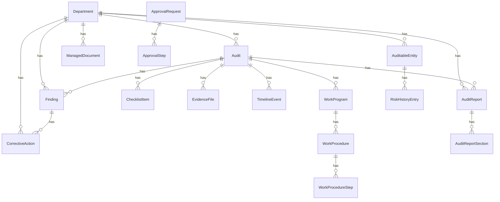

# IAMS Normalized Schema and ERD

This document captures the staged normalization introduced in `0005` while preserving backward compatibility.

## Migration strategy

1. Add nullable FK/polymorphic columns next to legacy string columns.
2. Keep serializers/views compatible with current API payloads.
3. Backfill FK fields from legacy text values in a follow-up data migration.
4. Switch reads/writes to FK-first.
5. Remove legacy string fields after rollout validation.

## ERD (core + new modules)

